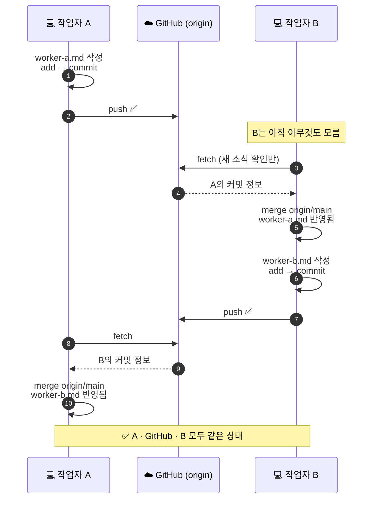
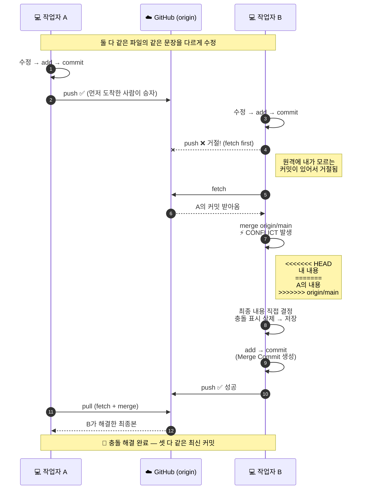

# 🔀 Git 협업 실습 — 시퀀스 다이어그램

> 4일차 실습: 작업자 A·B가 하나의 GitHub 저장소로 협업하며 충돌을 해결하는 전체 흐름

---

## 1️⃣ 충돌 없는 협업 — 서로 다른 파일을 수정

**핵심** — 다른 작업자의 변경은 **자동으로 내려오지 않는다.** `fetch`(확인) → `merge`(반영)를 직접 해야 한다.

---

## 2️⃣ 충돌 발생과 해결 — 같은 부분을 서로 다르게 수정

---

## 📌 한 장 요약

| 상황 | 명령 | 결과 |
|---|---|---|
| 내 작업 저장 | `add` → `commit` | 로컬 저장소에 버전 기록 |
| 올리기 | `push` | 원격이 앞서 있으면 **거절됨** |
| 받아오기 | `pull` (= `fetch` + `merge`) | 겹치면 **충돌**, 안 겹치면 자동 병합 |
| 충돌 해결 | 파일 수정 → `add` → `commit` → `push` | Merge Commit으로 마무리 |

---

## 🧊 3D 버전 — 보는 방법

위 다이어그램을 **마우스로 돌려볼 수 있는 3D**로 만든 [git-collab-3d.html](git-collab-3d.html) 파일이 이 저장소에 들어 있습니다.

다만 GitHub에서 이 파일을 클릭하면 완성된 화면이 아니라 **코드(설계도)** 가 보입니다. GitHub 저장소는 파일 "보관함"이라서 원본 코드를 그대로 보여주기 때문입니다.

**완성된 3D 화면을 보는 과정:**

1. 아래 링크를 클릭합니다. (프로그램 설치, 다운로드, 로그인 전부 필요 없습니다)

   ### ➡️ **[3D 다이어그램 열기](https://withandwithout0094.github.io/2026-git-start/git-collab-3d.html)**

2. 브라우저에 3D 다이어그램이 열리며 저절로 천천히 회전합니다. 휴대폰에서도 열립니다.

3. 혹시 알 수 없는 영어 코드가 보인다면 → 저장소 안의 파일을 클릭하신 것입니다. 위 1번의 링크로 다시 접속하면 됩니다.

> 위 링크는 **GitHub Pages** 기능으로 발행된 주소입니다. 보관함(저장소)에 있는 코드를 GitHub가 실행해서 "완성본 웹페이지"로 보여주는 기능으로, 저장소가 갱신되면 이 페이지도 자동으로 최신 내용이 됩니다.

---

## 🎬 애니메이션(만화) 버전

작업자 A와 B가 충돌을 겪고 화해하는 과정을 **6장짜리 코믹 애니메이션**으로 만들었습니다.

### ➡️ **[애니메이션 보러 가기](https://withandwithout0094.github.io/2026-git-start/git-collab-comic.html)**

링크를 클릭하면 자동으로 재생됩니다. (설치·로그인 불필요, 휴대폰 OK)
